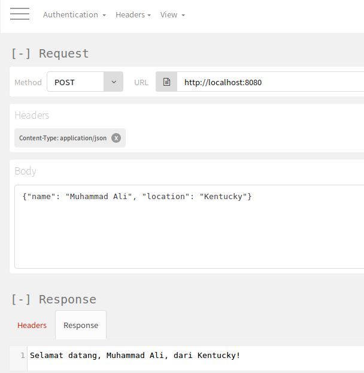

# Request

Request ialah segala maklumat yang datang daripada pengguna seperti browser
mana, link apa, dan HTTP method mana yang digunakan.

## Path variable

Kita boleh mendapatkan maklumat mengenai link menggunakan annotation
`@PathVariable`. Contoh,

```java
    @GetMapping("/page/{pageNo}")
    public String greeting(@PathVariable int pageNo) {
        return "Sekarang kita berada di muka surat " + pageNo;
    }
```

Pergi ke [http://localhost:8080/page/10](http://localhost:8080/page/10) di
browser untuk melihat hasilnya.

## Request parameter

Request parameter adalah salah satu cara untuk mengambil input daripada
pengguna. Annotation yang perlu digunakan ialah `@RequestParam`. Contoh,

```java
    @GetMapping("/nama")
    public String name(@RequestParam String name) {
        return "Nama saya ialah " + name;
    }
```

Sekarang route tersebut memerlukan parameter daripada pengguna. Contoh untuk
menghantar request parameter adalah dengan menaip di browser seperti berikut:

```
http://localhost:8080/nama?name=Muhammad Ali
```

Kemudian server akan menjawab,

```
Nama saya ialah Muhammad Ali
```

Request parameter adalah wajib. Jika anda tidak mahu mewajibkan request
parameter, anda boleh menetapkan annotation seperti berikut,

```java
    @GetMapping("/nama")
    public String name(
            @RequestParam(
                    required = false,
                    defaultValue = "hmm, lupa") String name) {
        return "Nama saya ialah " + name;
    }
```

## Request body

Kedua-dua cara di atas akan mendedahkan segala data yang dihantar oleh pengguna.
Cara tersebut tidak sesuai digunakan untuk maklumat yang sensitif seperti
password. Untuk itu, kita boleh menggunakan request body.

Sebelum mengambil request body, kita perlu mempunyai class yang menetapkan
bentuk data tersebut. Kita akan membuat class User sebagai contoh,

```java
public class User {
    private String name;
    private String location;

    public User() {}

    public User(String name, String location) {
        this.name = name;
        this.location = location;
    }

    public String getName() {
        return name;
    }

    public void setName(String name) {
        this.name = name;
    }

    public String getLocation() {
        return location;
    }

    public void setLocation(String location) {
        this.location = location;
    }
}
```

Untuk mengambil request body, kita perlu menggunakan annotation `@RequestBody`
seperti berikut,

```java
    @PostMapping("/")
    public String greeting(@RequestBody User user) {
        return "Selamat datang, " + user.getName() +
                ", dari " + user.getLocation() + "!";
    }
```

Request body biasanya dihantar melalui method `POST`. Jadi, kita perlu
menggunakan REST client untuk test code tersebut.


