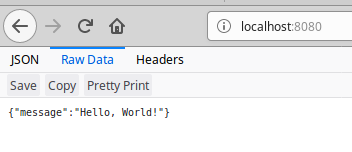
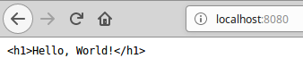

# Response

Response ialah maklumat yang kita ingin pulangkan kepada pengguna seperti jenis,
status dan kandungan response tersebut.

## Jenis Response

Dalam Spring Boot, jenis response bergantung kepada jenis data yang kita return.
Jika kita return String, kita akan memberi response dalam bentuk HTML secara
default.

```java
    @GetMapping("/")
    public String greeting() {
        return "<h1>Hello, World!</h1>";
    }
```

Jika kita return object, kita akan memberi response dalam bentuk JSON.

```java
@RestController
public class GreetingController {
    @GetMapping("/")
    public Message greeting() {
        return new Message("Hello, World!");
    }

    class Message {
        private String message;

        Message(String message) {
            this.message = message;
        }

        public String getMessage() {
            return message;
        }
    }
}
```



Format JSON selalu digunakan untuk komunikasi antara aplikasi. Contohnya
Android, server yang lain, atau single-page application.

Jika kita ingin menetapkan jenis response secara manual, kita boleh meletakkan
di parameter annotation seperti berikut:

```java
@RestController
public class GreetingController {
    @GetMapping(path = "/", produces = MediaType.TEXT_PLAIN_VALUE)
    public String greeting() {
        return "<h1>Hello, World!</h1>";
    }
}
```


