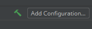

# Run Projek

Kita boleh menggunakan command build tool untuk run projek Spring Boot.

Jika anda menggunakan Maven, taip

```
mvn spring-boot:run
```

Jika anda menggunakan Gradle, taip

```
gradle bootRun
```

Kemudian console akan memaparkan segala log semasa menjalankan server. Setelah
selesai, kita boleh mencari tulisan seperti ini,

```
Tomcat initialized with port(s): 8080 (http)
```

Perhatikan nombor 8080 tersebut. Itu merupakan port untuk server yang kita telah
run. Untuk melihat web tersebut, buka browser kemudian pergi ke
`localhost:8080`. Anda akan melihat error page kerana kita masih belum menulis
apa-apa lagi.

Jika anda masih ingat, sebelum ini kita anda menambah dependency 'Devtools'.
Dengan adanya Devtools, code yang kita akan tulis nanti akan terus update pada
server. Jadi, kita tidak perlu lagi tutup, kemudian compile semula aplikasi
seperti aplikasi Java yang lain. Walau bagaimanapun, feature ini bergantung
kepada IDE.

Untuk Eclipse, server akan update tiap-tiap kali kita save file.

Untuk IntelliJ, server akan update apabila kita build aplikasi dengan klik ke
gambar tukul berwarna hijau, seperti berikut,


