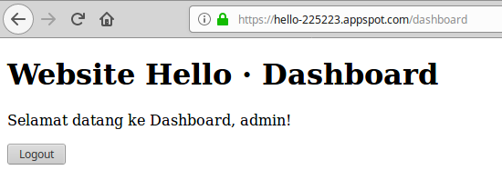

# Google App Engine

Google App Engine(GAE) juga adalah salah satu PaaS. Disebabkan GAE terlalu
berbeza, maka saya asingkan ke dalam topik yang baru.

GAE adalah sebahagian daripada Google Cloud Platform. Google Cloud Platform
terbahagi kepada dua, iaitu Flexible dan Standard. Flexible adalah sama seperti
PaaS yang lain, manakala Standard adalah versi yang terhad. Nama Google Cloud
Standard yang lama ialah Google App Engine, jadi apabila orang sebut GAE atau
Standard, dua-dua merujuk benda yang sama.

GAE terhad dari segi infrastructure. Contoh untuk database, kita tidak boleh
menggunakan database SQL, kita perlu menggunakan Datastore yang dibina oleh
Google sendiri.

Sekarang kita cuba deploy aplikasi daripada [tutorial Spring
Security](../springsecurity/) ke GAE.

----

Documentation yang kita boleh rujuk ialah [Deploy Spring Boot Application in App
Engine
standard](https://codelabs.developers.google.com/codelabs/cloud-app-engine-springboot/index.html#0).

Antara perubahan yang saya lakukan ialah:

1. Tukar packaging projek dari `jar` ke `war` di `pom.xml`:
```xml
    <groupId>com.jombelajarjava</groupId>
    <artifactId>hello</artifactId>
    <version>0.0.1-SNAPSHOT</version>
    <packaging>war</packaging>
```

2. Tambah properties untuk maven compiler:
```xml
    <properties>
        ...
        <maven.compiler.source>1.8</maven.compiler.source>
        <maven.compiler.target>1.8</maven.compiler.target>
    </properties>
```

3. Tambah dependency Tomcat, dan tukar scope ke `provided`:
```xml
        <dependency>
            <groupId>org.springframework.boot</groupId>
            <artifactId>spring-boot-starter-tomcat</artifactId>
            <scope>provided</scope>
        </dependency>
```

4. Tambah plugin untuk `appengine-maven-plugin`:
```xml
        <plugins>
            ...
            <plugin>
                <groupId>com.google.cloud.tools</groupId>
                <artifactId>appengine-maven-plugin</artifactId>
                <version>1.3.2</version>
            </plugin>
        </plugins>
```

5. Bina file `src/main/webapp/WEB-INF/appengine-web.xml` dengan kandungan:
```xml
<?xml version="1.0" encoding="utf-8"?>
<appengine-web-app xmlns="http://appengine.google.com/ns/1.0">
  <threadsafe>true</threadsafe>
  <runtime>java8</runtime>
  <sessions-enabled>true</sessions-enabled>
</appengine-web-app>
```

6. Bina class `ServletInitializer` dengan kandungan:

```java
package com.jombelajarjava.hello;

import org.springframework.boot.builder.SpringApplicationBuilder;
import org.springframework.boot.web.servlet.support.SpringBootServletInitializer;

public class ServletInitializer extends SpringBootServletInitializer {
    @Override
    protected SpringApplicationBuilder configure(SpringApplicationBuilder builder) {
        return builder.sources(HelloApplication.class);
    }
}
```

Setelah deploy, kita boleh melayari website kita.


