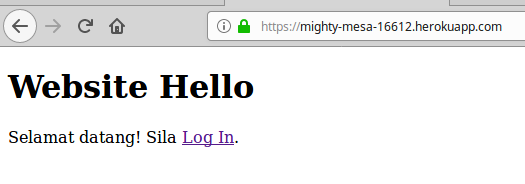

# Platform as a Service (PaaS)

PaaS adalah sama seperti server hosting, tetapi mereka telah menyediakan semua
infrastructure. Jadi kita tidak perlu setup server bagai. Hanya perlu upload
code.

Antara PaaS yang kita boleh pilih ialah:

- [Heroku](https://www.heroku.com/)
- [Jelastic](https://jelastic.com/)
- [AWS Elastic Beanstalk](https://aws.amazon.com/elasticbeanstalk/)
- Mana-mana server hosting menggunakan [Dokku](http://dokku.viewdocs.io/dokku/)

Sekarang kita akan cuba deploy aplikasi yang kita telah buat dalam [tutorial
Spring Security](../springsecurity/) di Heroku. Saya pilih Heroku kerana ada
pilihan yang percuma. Jika anda ingin saja-saja cuba deploy website atau mungkin
untuk homework, anda boleh menggunakan Heroku.

## Heroku

Setiap PaaS mempunyai cara penggunaan yang berlainan, jadi kita perlu mencari
documentation di website Heroku, iaitu [Getting Started on Heroku with
Java](https://devcenter.heroku.com/articles/getting-started-with-java).

Sekarang saya cuba ringkaskan apa yang telah saya lakukan semasa mengikuti
documentation tersebut.

1. Heroku menggunakan Git untuk build code. Jadi, saya menjadikan code tersebut
sebagai Git repository. Anda boleh mengikuti tutorial Git [di
sini](https://www.jombelajarjava.com/git/).

2. Disebabkan saya menggunakan Xubuntu, maka saya install heroku menggunakan
   snap dengan command `sudo snap install heroku --classic`.

3. Login heroku dalam terminal, `heroku login`.

4. Tambah remote pada repository menggunakan `heroku create`.

5. Upload code ke Heroku menggunakan Git, `git push heroku master`.

Setelah selesai, terminal akan memaparkan url untuk website yang sudah siap.
Maka, kita sudah boleh melayari website kita.

Kita juga boleh melayari website kita dari komputer lain, contohnya mobile
phone.

## Domain name

Jika kita lihat url di atas nampak serabut. Biasanya website mempunyai url yang
cantik seperti `google.com`, `youtube.com`, dan `jombelajarjava.com`. Untuk itu
kita boleh mencari domain hosting. Saya mencadangkan
[Namecheap](https://www.namecheap.com/) atau [Google
Domains](https://domains.google/). Ikut sahaja arahan yang diberikan dalam
website tersebut.
